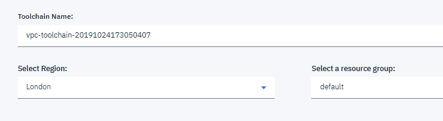
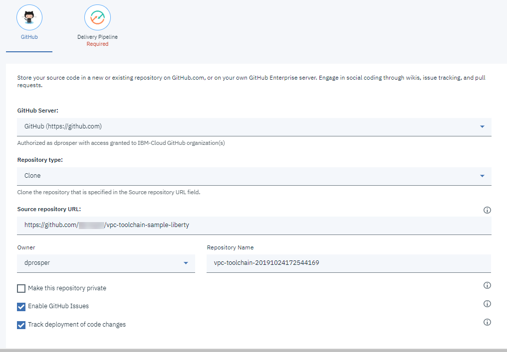

## IBM Cloud Toolchain for VPC

This is a companion repository to a blog post that is available [here](https://www.ibm.com/cloud/blog/application-deployment-to-a-virtual-private-cloud-with-a-devops-toolchain).

## Requirements

- A public [GitHub](https://github.com) account. 

- A Pay as You Go (PAYG) IBM Cloud account, the toolchain that is created by this repository will create resources in IBM Cloud VPC that will cost you money to run.  The currently smallest available virtual server instance on VPC Gen 2 is used, i.e. 2 cores, 4 GB RAM and 100 GB of storage. We start with:
   - 2 virtual server instances (VSI): 1 for running the sample app and 1 bastion host
   - scale up to 3 VSIs for running the sample app (optional). 

- The sample application runs on [WebSphere Liberty V21.0.0.2 with Java EE 8 Web Profile](https://www.ibm.com/support/pages/node/6250961#asset/runtimes-wlp-webProfile8) with a JVM heap size set to a maximum of 512M. The WebSphere Liberty product is licensed for development and limited production use. The full license terms can be viewed [here](https://public.dhe.ibm.com/ibmdl/export/pub/software/websphere/wasdev/license/base_ilan/ilan/19.0.0.10/lafiles/en.html).

- Install the IBM Cloud CLI by [following these steps](https://cloud.ibm.com/docs/cli?topic=cloud-cli-install-ibmcloud-cli). 

- Install the *Infrastructure Service* plugin used for VPC.  
   ```sh
      ibmcloud plugin install infrastructure-service
   ```

- Your IBM Cloud user account needs permissions to create and manage VPC resources. See the list of required permissions for [VPC Gen 2](https://cloud.ibm.com/docs/vpc-on-classic?topic=vpc-on-classic-managing-user-permissions-for-vpc-resources). 

- This toolchain requires an API Key that will run with your permissions. During the toolchain creation, you will be prompted to either create a new API key for use by the toolchain or paste an existing one.  An API key is a unique code that is passed to an API to identify the application or user that is calling it. To prevent malicious use of an API, you can use API keys to track and control how that API is used. For more information about API keys, see [Understanding API keys](https://cloud.ibm.com/docs/iam?topic=iam-manapikey).

- The toolchain and associated scripts require at least one SSH key to access the virtual servers - and you may as well. If you don't have an SSH key, you can create one by following the steps below, please note that IBM Cloud VPC requires a key size of 2048 or 4096.   

   - Create the SSH Key on your local system
   ```sh
      ssh-keygen -t rsa -P "" -C "vpc.toolchain@noreply.com" -f ~/.ssh/id_rsa_vpc_tc -b 4096
   ```

- There are minimal steps that need to be performed on your local machine, however, these are written to work in a Bash shell.  If you are using a Windows OS, make sure to install [Git for Windows](https://gitforwindows.org/) as it includes a Bash shell. 

## Before you create the Toolchain

### Upload your SSH Public key to the VPC region
   
   1. Login to IBM Cloud via a terminal window:
      ```sh
      ibmcloud login
      ```

   1. Target your resource group and region.  You can find a list of available regions in VPC [here](https://cloud.ibm.com/docs/vpc-on-classic?topic=vpc-on-classic-creating-a-vpc-in-a-different-region)
      ```sh
      ibmcloud target -r YOUR_REGION
      ```

   1. If you created the SSH key as described under the requirements section, you will need to upload it to the IBM region. If you are using an existing SSH Key and is has not been uploaded to the desired VPC region, you can also follow these steps to upload it. 

      On Windows OS
      ```sh
         MSYS_NO_PATHCONV=1 ibmcloud is key-create vpc-toolchain @~/.ssh/id_rsa_vpc_tc.pub
      ```

      On a Mac OS or Linux OS
      ```sh
         ibmcloud is key-create vpc-toolchain @~/.ssh/id_rsa_vpc_tc.pub
      ```

   1. For the SSH key that you have created, you will need to add the private key to the toolchain configuration during its creation. The private key needs to be base64 encoded. To encode the private key, run the following command and copy the output to your clipboard: 

      On Windows OS
      ```sh
         base64 ~/.ssh/id_rsa_vpc_tc | tr -d \\n
      ```

      On a Mac OS
      ```sh
         base64 ~/.ssh/id_rsa_vpc_tc
      ```

      On a Linux OS
      ```sh
         base64 -w 0 ~/.ssh/id_rsa_vpc_tc
      ```

# Creating the Toolchain 

This IBM Cloud Toolchain for VPC provides a starting point for creating applications running on virtual server instances in IBM Virtual Private Cloud (VPC). It will: 
   
   - Create a Virtual Private Cloud in a given region.
   - Create One (1) to three (3) virtual server instances across three (3) IBM Cloud VPC availability zones and One (1) load balancer.  
   - Deploy a very simple web application running on top of [WebSphere Liberty](https://developer.ibm.com/wasdev/).

   

 
   1. Click the **Create Toolchain** button to get started.

      [](https://cloud.ibm.com/devops/setup/deploy/?repository=https://github.com/IBM-Cloud/vpc-toolchain-liberty-sampleapp)


   1. In the upper section of the screen, specify: 
      - **Toolchain name**, a name to use for the toolchain or keep the default generated name.  
      - **Select Region**, the region in which to deploy the toolchain, note that it is not required to deploy the toolchain in the same region where you will be deploying the VPC. 
      - **Select a resource group**, the resource group to use, note that it can also be different from the resource group used for deploying the VPC resources.

      

   1. In the lower section of the screen, GitHub is the first tool that is integrated with this toolchain.  If this is the first time running a toolchain that is integrated with GitHub you will get prompted to authorize access to your GitHub account.  The toolchain will `clone` our sample repository to your own GitHub account, that cloned version of the repository will be used by the Delivery Pipeline when it is running. You can specify:
      - **Owner**, this can be a user or organization in GitHub that you have access to
      - **Repository Name**, this can be anything you want or keep the default
      - **Make this repository private**, since this will be created in Public GitHub you can elect to make that clone a private repository. 
      - Leave all other settings alone

      


   1. In the Delivery Pipeline tab, specify:
      - **IBM Cloud API Key**, you can click on **Create** to create a new key or paste an existing key if you have one.
      - **SSH Private Key**, this is where you paste the text that was generated when you based64 encoded your private key earlier.  Note this private key will be stored as part of your toolchain only accessible by you or your delegates, it will not be added to the GitHub repository.  
      - **VPC Resource Group**, the resource group where your VPC resources will be created.
      - **VPC Resources Prefix**, a prefix to use when creating the resources in VPC.
      - **VPC Region**, the VPC region to use.
      - **VPC SSH Key**, the name of the SSH key that you generated and added to VPC earlier. 

      

   1. Click on **Create** at the top of the page

   1. It takes just a few seconds to create the toolchain with GitHub Issues, GitHub Repo and Delivery Pipeline integrations. From the Toolchain page, click on the **Delivery Pipeline** to track its progress. 

      

   1. The expectation is the **App Build Stage** and **VPC Deploy Stage** in the pipeline will complete without any errors. The **VPC Clean-up Stage** will not run until you manually initiate it, it will be used to delete the VPC resources later on.  The first time the pipeline runs it may take 15 minutes as it creates the VPC, Subnets, Virtual Servers, and Load Balancers for the first time.  Subsequent runs should run faster unless you make changes to the infrastructure components.  Click on **View logs and history** on each of the stages in the pipeline to review the in-progress or completed jobs.  

      

   1. Click on **View logs and history** on the *VPC Deploy Stage* card, you should have a result similar to the screenshot below.  The last entry in the log provides the URL to the application, health check endpoint and root endpoint. The hostname is that of the VPC public load balancer that was deployed. Enter the address of the application in your browser and confirm you can access it.

      

   1. Visit the VPC pages for your region and confirm all the expected resources are there, recall they will all use the *prefix* you supplied when you created the toolchain. 
      - [Virtual server instances](https://cloud.ibm.com/vpc/compute/vs)
      - [Subnets](https://cloud.ibm.com/vpc/network/subnets)
      - [Load balancers](https://cloud.ibm.com/vpc/network/loadBalancers)

   1. Back to the Delivery Pipeline, use the bread crumbs at the top of the page to navigate to the toolchain page.  Click on the **GitHub** card and you will be taken to the repository that was cloned to your GitHub account.

      

   1. You can clone this repository to your local machine and use your favorite editor to make a few changes. The first changes will make is to modify the `terraform` template and increase the number of virtual server instances our app runs under from 1 to 2 or 3 (The template is currently meant to support a max of 3, but if you are familiar with Terraform you can modify it as needed to handle additional instances.)

      Edit the `terraform/variables.tf` and increase the `vpc_zone_count` variable from from 1 to 3 (or 2). Save your changes and push the updates back to GitHub.

      

   1. Go back to the Delivery Pipeline, you will notice that a new run of the pipeline as started. After this run, you will now have additional virtual servers and subnets added. Those new servers are also added to the Load Balancer.  Visit the VPC pages for your region and confirm all the expected resources are there, recall they will all use the *prefix* you supplied when you created the toolchain. 
      - [Virtual server instances](https://cloud.ibm.com/vpc/compute/vs)
      - [Subnets](https://cloud.ibm.com/vpc/network/subnets)

   1. Access the application again using your browser and the address of the load balancer.  If you refresh the page multiple times you should see the value next to `Running on virtual server instance:` change to the actual virtual server that is responding to your request.

   1. Back to the repository on your local machine. Make a small change to the `webapp/index.html`, for example add the `<p>This is working great !!</p>` entry as shown below. Save your changes and push the updates back to GitHub.

      ```html
        <body>
          <section id="appIntro">
              <div id="titleSection">
                <h1 id="appTitle">System Properties Sample</h1>
                  <div class="line"></div>
                  <div class="headerImage"></div>
                  <h2>Congrats on your shiny new sample app running on WebSphere Liberty!</h2>
                  <h2 id="hostnameValue"></h2>
                  <p>This sample app uses a System Properties microservice to return the properties of the system that you're running.</p>
                  <p>This is working great !!</p>
                </div>                  
            </section>
        </body>
      ```

   1. Back to the Delivery Pipeline, you will notice that a new run of the pipeline as started. At completion, try to access the application using your load balancer address, you should see the changes you made to the application.  

# Clean-up 
   The resources created by this project in the IBM Cloud VPC come at a cost to your account. Perform the following steps to delete/remove the resources you no longer use. 

   - Go back to the Delivery Pipeline. On the **VPC Deploy Stage** card click on the icon to the right of the *LAST EXECUTION RESULT* and select **Send To VPC Clean-up Stage**, this will start the `Clean-up Stage` that will perform a delete of all the VPC resources that were created during the last run of the **VPC Deploy Stage**

      

   - Delete the toolchain from the [Toolchains page](https://cloud.ibm.com/devops/toolchains). There is no cost for having a toolchain, but you may not want the toolchain to run and recreate the VPC resources

   - Validate the VPC resources are deleted via the UI.  Go through each of the pages below validate the resources created by the toolchain are no longer there.
      - [Virtual server instances](https://cloud.ibm.com/vpc/compute/vs)
      - [Load balancers](https://cloud.ibm.com/vpc/network/loadBalancers)
      - [Subnets](https://cloud.ibm.com/vpc/network/subnets)
      - [VPC](https://cloud.ibm.com/vpc/network/vpcs)
